# How to make an output report (case of future design)

# prior
1. connect to the platform via their account
2. activate the develop mode in the Odoo parameter setting (see this image)
- click on settings -> below the page: activate developer mode
        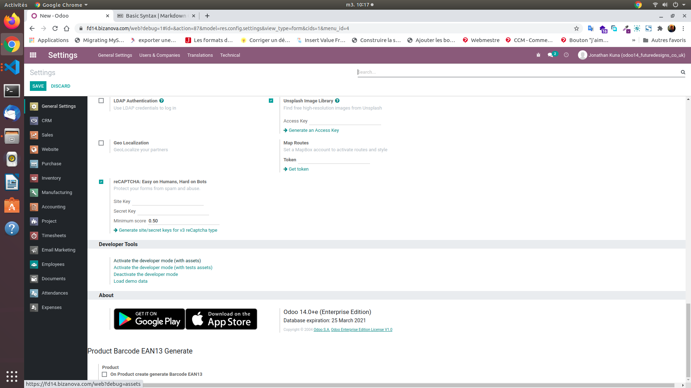

# header and footer

## 1. configuration layout
- In the same window at "Business Documents" level, where it is written Layout
- click on Configure your document layout

    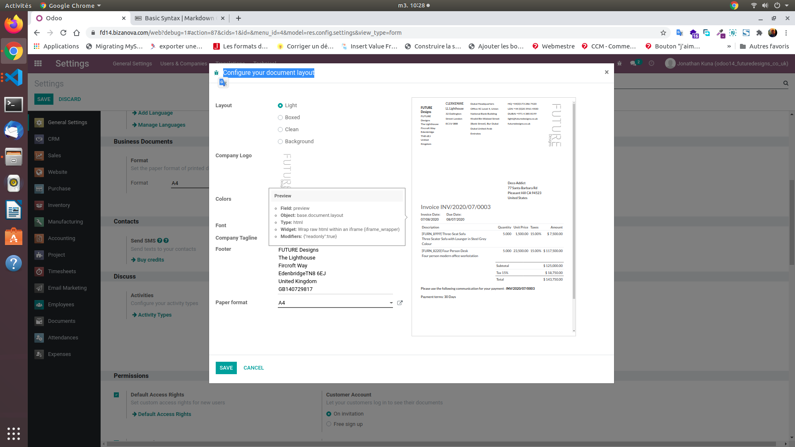

- among the basic model choose the model that suits you.
- add your company logo or header.
- choose the color.
- the police.
- the name of the company.
- footer information.
- the paper size.

- NB: this information is not binding but is necessary for a normal report.

- Then click on save.

## 2. Edit Layout
> In the same window at "Business Documents" level

- where it is written Layout
- click on Edit layout

   
you will be redirected to the QWEB page of the external_layout_standard view (view which supports the header and the footer)

- to modify the qweb code of the view just click on the EDIT button in hat on the left

- you must have knowledge of the qweb, the html or its use with bootstrap to make modifications because a false maneuver will cause an error and the modifications will not be saved

    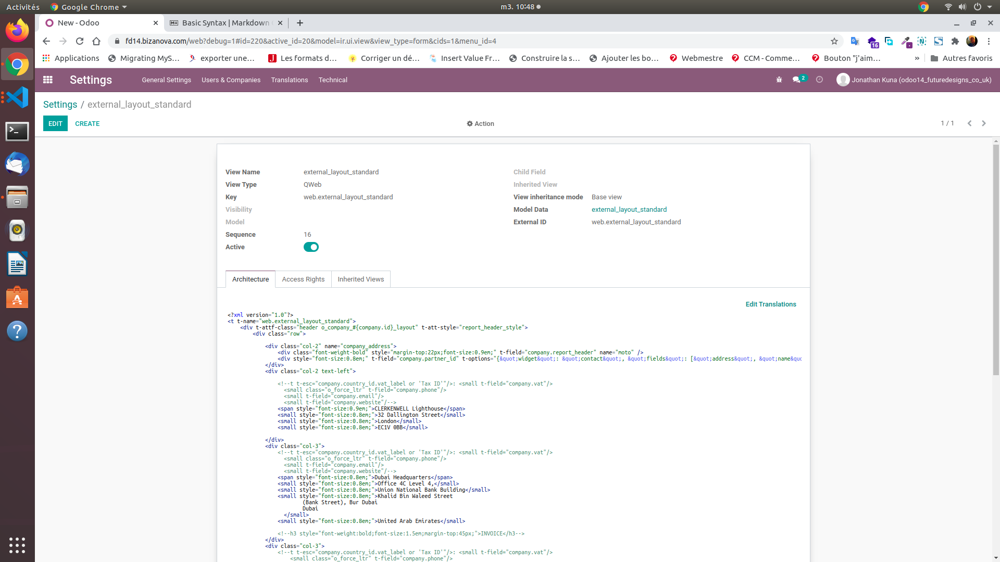

- NB: your layout must be selected by default (you will see it clearly when you are in develop mode)

    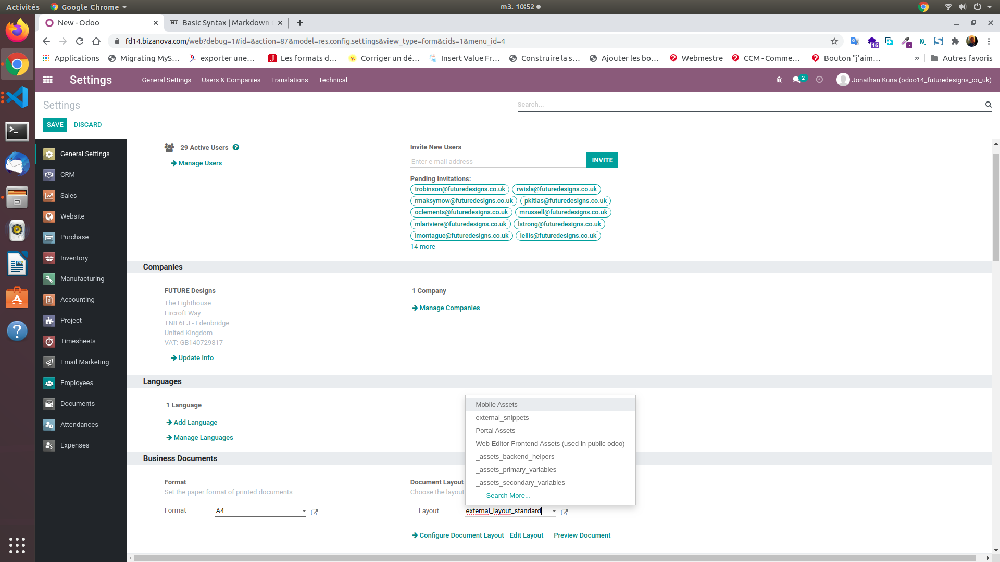

# Edit sales report / quotation order / delivery

## 1. Two ways to proceed either by searching directly for the name of the view or the report
- click on the setting option
- in the navbar or menu bar at the top click on Technical
- on the submenu that appears click either on view or report

    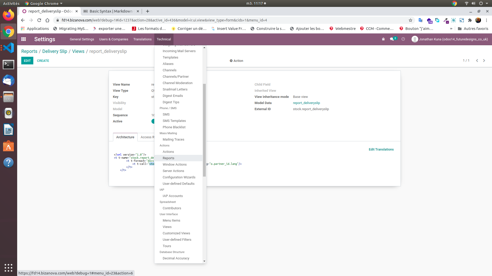

    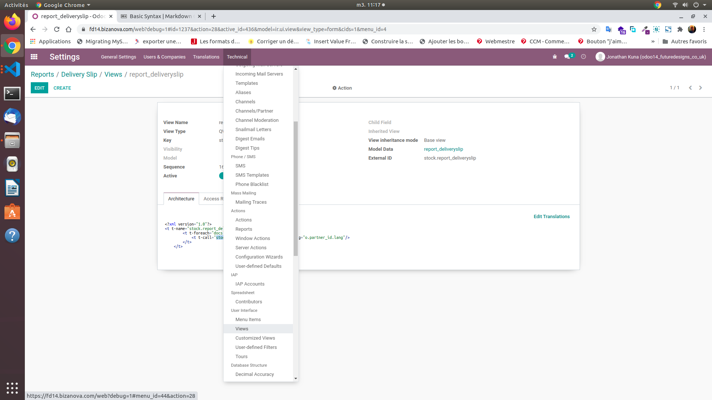

   - example at the report level, in the search bar on the right type "quotation" then validate

        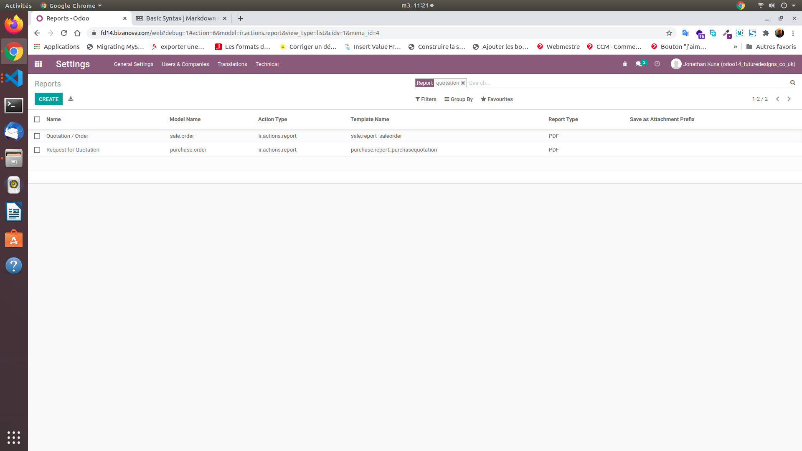
            
        - by selecting the first line "Quotation / Order"
        
        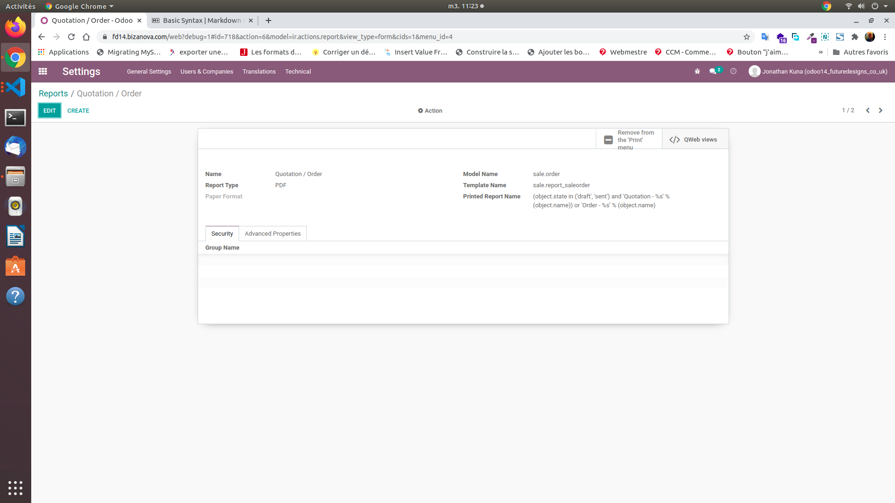

        - to have the possibility to modify the report, click on the qweb tab to the right of the "Qweb views" modal.
            you access the different views of the report that you can then modify

        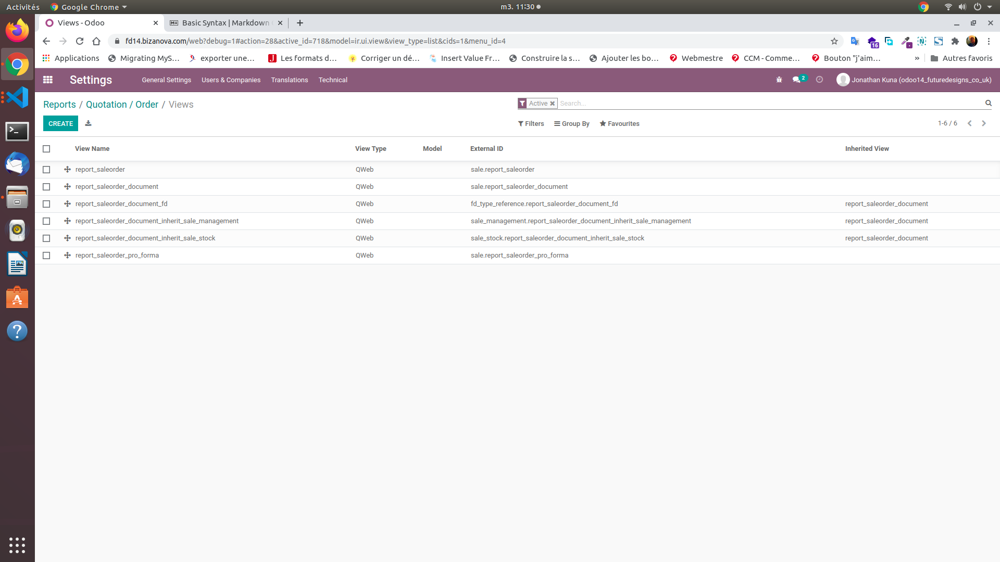

        
        - for the "report_saleorder_document" view of the "Quotation" report, you therefore have the possibility here to edit

            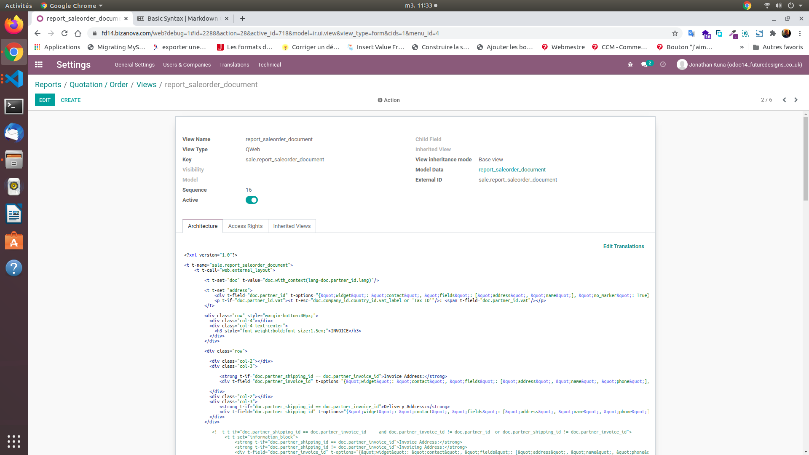

        
    - example at the view level (if you know its name directly) type "report_saleorder_document"

        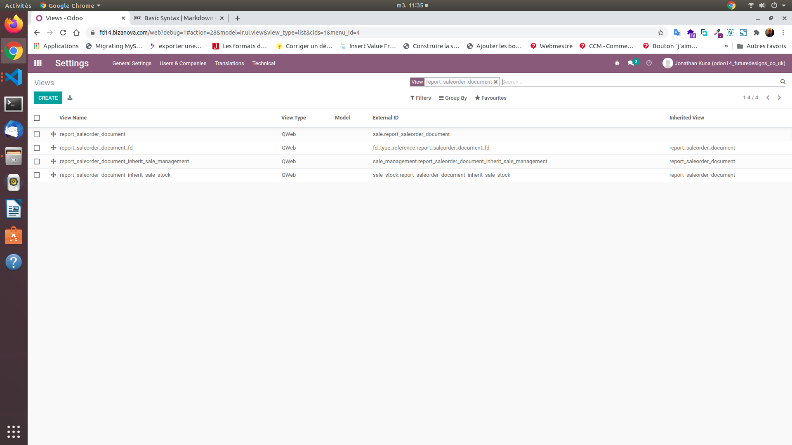

        - select the view to modify (example for report_saleorder_document)

        

            
            - it only remains to edit

# print the report

## 1. Let us take the case of the sale because it is linked with the modfier report above (quaotation / report_saleorder_document)
- the sales module must exist beforehand
- click on the sales module
- click on create at the top right
- Fill in the sales information

    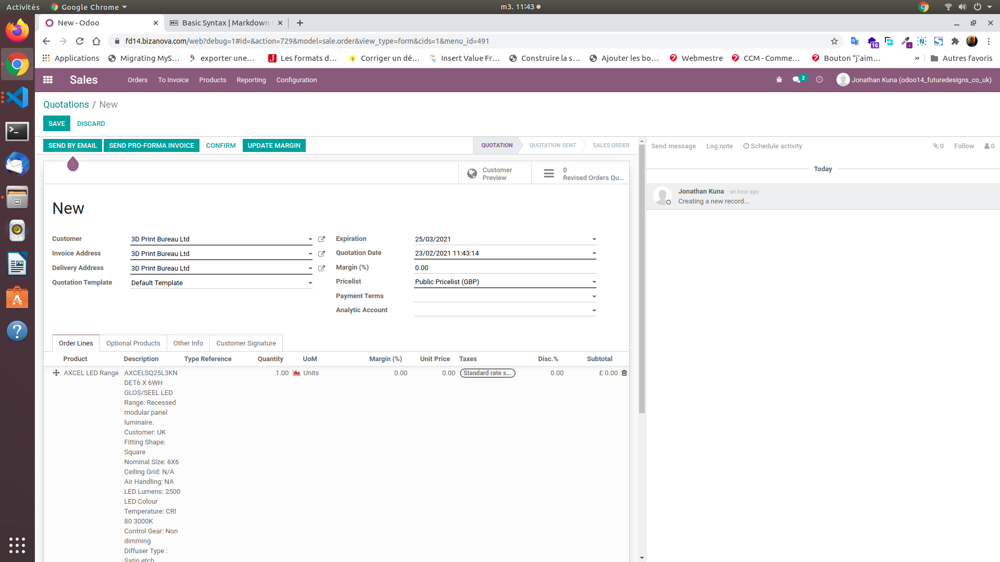

- save
- In the middle above click on print> quotation / order

    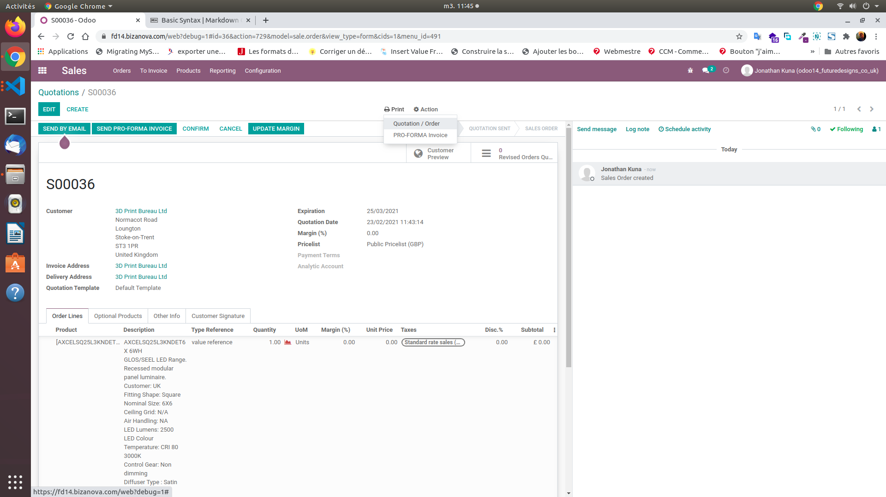

    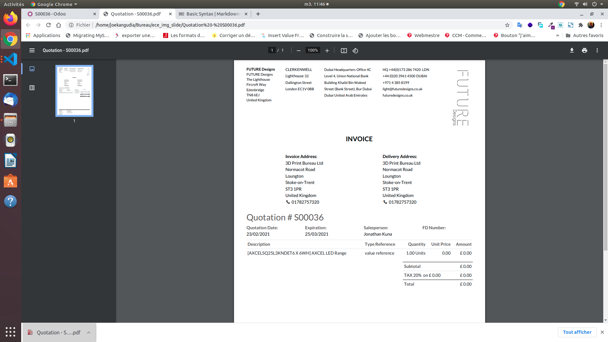

                
            

